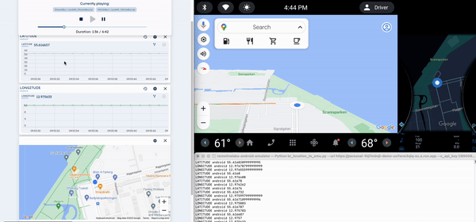
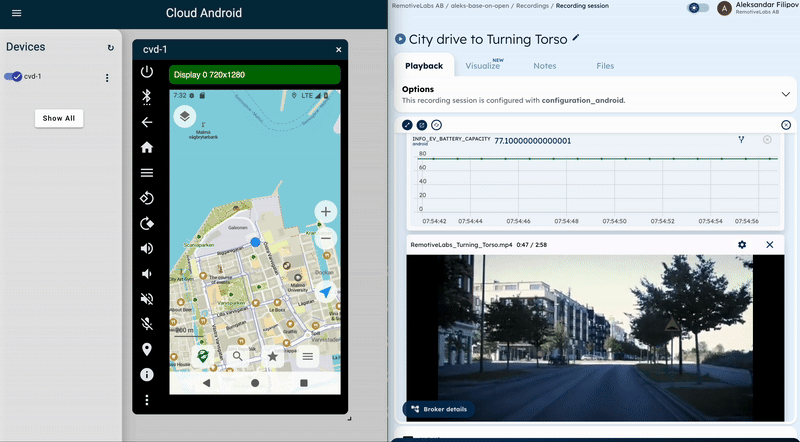

# RemotiveLabs and Android

This is an example that shows how you can send to real vehicle signals from [RemotiveCloud](https://cloud.remotivelabs.com/) to an Android device, either an emulator or cuttlefish. The signals can be either location GPS signals or VHAL properties like speed, gear, battery status, etc.



Check the [video](media/video_example_location_broker_to_emu_720.mov) in */media* for an example on how location can be sent from [RemotiveCloud](https://cloud.remotivelabs.com/)
to AAOS emulator.

## Setup

### Python

Install the dependencies needed to run the script. This includes libraries to communicate with the RemotiveCloud.

```bash
pip install -r requirements.txt
```

### Android emulator

Download the Android Studio Preview version: <https://developer.android.com/studio/preview>

For the android emulator you will need to chose what type of image that you wish to run. If the goal is to only send location data you can chose an image with Google Play Store included which has the Google Maps app pre installed. If you wish to include VHAL properties then you need one with Google APIs instead as they have support for VHAL. This will not have the Google Maps App pre installed so you will have to install it yourself (or any other map app). Make sure to pick an image matching your systems architecture.

- Android Automotive with Google Play x86_64 System Image (With Google maps)
- Android Automotive with Google APIs x86_64 System Image (Support for VHAL)

When using the emulator with VHAL properties it also needs to be started in permissive mode which must be done from the terminal. Run the emulator via [command line](https://developer.android.com/studio/run/emulator-commandline):

```bash
emulator @<adv_name> -selinux permissive -no-snapshot
```

Note that you must set SELinux as permissive mode!

### Cuttlefish



For running the example together with cuttlefish we will show how to run it with the cuttlefish device in a docker container. This requires you to either build your own image or use one that is pre-built. [Build and run Cuttlefish](/cuttlefish/README.md)

### Maps

If you use an emulator without Google Maps or if you use Cuttlefish you may wish to install your own. You can for example use the one from the screenshots,  `https://organicmaps.app/`, download the apk and install it by doing `adb install app.organicmaps_25030207.apk`

## Run

Create a free [RemotiveCloud](https://cloud.remotivelabs.com/) account and go to the Recordings page. Choose the *City drive to Turning Torso* recording and start the playback. Make sure to pick *configuration_android* when playing.  
**Note!** If you already have an account, you can import the *City drive to Turning Torso* recording by clicking the import icon in the upper right corner of the recording page.

You may control the playback using our cli tool if needed. See url of playback for project and session ids.

```
remotive cloud auth login
remotive cloud recordings mount $SESSION_ID --transformation-name 'configuration_android'  --project $PROJECT_ID
remotive cloud recordings seek $SESSION_ID --seconds 60 --project $PROJECT_ID
remotive cloud recordings play $SESSION_ID --project $PROJECT_ID
```

Before running you need to set some environment variables for authentication with the RemotiveCloud. After starting a playback in the RemotiveCloud you can find the needed API_KEY and URL after opening the `Broker Details` in the bottom left.

```

export PROTOCOL_BUFFERS_PYTHON_IMPLEMENTATION=python
export URL=<broker_url>
export API_KEY=<broker_api_key>
```

### Location

To run the example in the simplest form, run the following python module. This will begin subscribing signals from the RemotiveCloud and pass the location data towards the Android device.

#### Emulator location

```bash
# Emulator
python3 -m android_bridge \
  --url $URL \
  --api-key $API_KEY \
  --with-location

# Cuttlefish
python3 -m android_bridge \
  --url $URL \
  --api-key $API_KEY \
  --with-location \
  --virtual-device-type cuttlefish
```

### VHAL properties

The same script can be used to feed VHAL properties to either the emulator or the cuttlefish instance. Do so by adding the `--with-vhal` flag. As the signals output by the RemotiveCloud recording are strings with a readable name but the Android VHAL expects a numerical id we also need to supply a mapping file with `--signal-mappings-file example_mappings.json`. This should contain the name of the signal as sent by the RemotiveCloud android transformation and the `area_id` and `prop_id` that Android expects. See <https://developer.android.com/reference/android/car/VehiclePropertyIds> for a full list of what is possible in the reference implementation but this might be different for a custom Android build.

```bash
# Emulator
python3 -m android_bridge \
  --url $URL \
  --api-key $API_KEY \
  --with-vhal \
  --signal-mappings-file example_mappings.json

# Cuttlefish
python3 -m android_bridge \
  --url $URL \
  --api-key $API_KEY \
  --with-vhal \
  --signal-mappings-file example_mappings.json \
  --virtual-device-type cuttlefish
```

If you want to limit the amount of VHAL properties you send to Android you can supply signal names with the `--signal PERF_VEHICLE_SPEED` flag to pass only those instead of all the ones found in the mapping file.

```bash
python3 -m android_bridge \
  --url $URL \
  --api-key $API_KEY \
  --with-vhal \
  --signal-mappings-file example_mappings.json \
  --signal PERF_VEHICLE_SPEED \
  --signal ENGINE_RPM
```

### Combined location and properties

It is possible run the script with both location and VHAL properties enabled at the same time, simply supply both arguments.

```bash
python3 -m android_bridge \
  --url $URL \
  --api-key $API_KEY \
  --with-location \
  --with-vhal \
  --signal-mappings-file example_mappings.json
```

### Additional configurations

It is possible to override things such as emulator names, cuttlefish urls and so on, see the `android_bridge/arguments.py` for the full list.

## Documentation

Check docs/build/html/index.html for further details regarding this project, including how to setup
your environment, emulator and scripts.

There is also a section about lessons learned and improvements for this project (docs/build/html/insights.html).

## Useful hints

If you are deploying in cloud this port config might be handy. It enables `WebRTC` along with `ADB` and a `rest` interface.  

```
ssh -i ~/.ssh/google_compute_engine aleksandar_remotivelabs_com@34.34.135.209 -L 8443:localhost:8443 -L 5555:localhost:5555 -L 15550:localhost:15550 -L 15551:localhost:15551 -L 15552:localhost:15552 -L 15553:localhost:15553 -L 15554:localhost:15554 -L 15555:localhost:15555 -L 15556:localhost:15556 -L 15557:localhost:15557 -L 15558:localhost:15558 -L 15559:localhost:15559 -L 5037:localhost:5037 -L 1443:localhost:1443
```

The coordinates are sent using `rest` to the Cuttlefish virtual Android device, more information can be found here: <https://source.android.com/docs/devices/cuttlefish/control-environment>.

Protos for location can be found here: <https://android.googlesource.com/device/google/cuttlefish/+/refs/heads/master/host/commands/gnss_grpc_proxy/gnss_grpc_proxy.proto>  
Protos for VHAL properties can be found here: <https://android.googlesource.com/platform/hardware/interfaces/+/refs/heads/main/automotive/vehicle/aidl/impl/current/>
