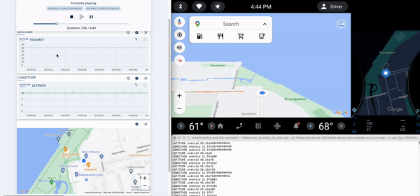

# RemotiveLabs and Android Emulator

This is a set of Python scripts to redirect data from [RemotiveCloud](https://cloud.remotivelabs.com/) to AAOS emulator.



Check the [video](media/video_example_location_broker_to_emu_720.mov) in */media* for an example on how location can be sent from [RemotiveCloud](https://cloud.remotivelabs.com/)
to AAOS emulator.

## Setup

It is highly recommended that you read the documentation in *docs/build/html/index.html*,
as it describes the steps in more details. It can be tricky to make it work if you miss
some configurations.

Make sure to install the dependencies.

```bash
pip install -r requirements.txt
```

Download the Android Studio Preview version:
https://developer.android.com/studio/preview

## Run

Create a free [RemotiveCloud](https://cloud.remotivelabs.com/) account and go to the Recordings page. Choose the _City drive to Turning Torso_ recording and start the playback. Make sure to pick _configuration_android_ when playing. 
**Note!** If you already have an account, you can import the _City drive to Turning Torso_ recording by clicking the import icon in the upper right corner of the recording page. 

### Send Location

Run the [AAOS Emulator](https://developer.android.com/studio/run/managing-avds).
For sending location, you can use an user image such as:
* Automotive 12L with Play Store ARM 64 v8a System Image
    * If your machine is **ARM** based. It is an user build with GAS.
* Automotive 12L with Play Store Intel x86 Atom_64 System Image
    * If your machine is **x86** based. It is an user build with GAS.


Include the credentials from the broker (URL and API key) as well as the LATITUDE and LONGITUDE signals:
```bash
$ python3 br_location_to_emu.py --url $URL --x_api_key $KEY --namespace android --signal LATITUDE --signal LONGITUDE
```
**Note!** You can find the broker credentials in the bottom left corner once you have prepared the recording for playback.

### Set VHAL Properties
To manipulate VHAL properties, you must use an userdebug build:
* Android Automotive 13 "Tiramisu" with Google APIs ARM 64 v8a System Image
    * It does not contain GAS, but it is userdebug.

Run the emulator via [command line](https://developer.android.com/studio/run/emulator-commandline):
```bash
$ emulator @$avd_name -selinux permissive -no-snapshot
```
Note that you must set SELinux as permissive mode.

If you want to send VHAL property values to AAOS emulator:
```bash
$ python3 br_props_to_aaos.py --url $URL --x_api_key $KEY --namespace android --signal $SIGNAL
```
alternatively
```bash
$ PROTOCOL_BUFFERS_PYTHON_IMPLEMENTATION=python python3 br_props_to_aaos.py --url $URL --x_api_key $KEY --namespace android --signal $SIGNAL
```
Send the signals you want by always putting the flag *--signal* alongside its name.

## Documentation
Check docs/build/html/index.html for further details regarding this project, including how to setup
your environment, emulator and scripts. 

There is also a section about lessons learned and improvements for this project (docs/build/html/insights.html).

# RemotiveLabs and Cuttlefish virtual Android devices
In this setup you can get Android running in a containerized environment

## Setup cuttlefish


Check the [video](media/video_example_location_broket_to_cuttlefish.mov) in */media* for an example on how location can be sent from [RemotiveCloud](https://cloud.remotivelabs.com/)

### Setup your cuttlefish deployment

- Follow this guide: https://source.android.com/docs/devices/cuttlefish/get-started
- Navigate to your cuttlefish deployment eg https://localhost:8443/

In the screenshots `https://organicmaps.app/` is used, download the apk and install it by doing `adb install app.organicmaps_25030207.apk`

## Start playback of you desired stream

> Below hints are copied from the graphical playback interface.
```
remotive cloud auth login
remotive cloud recordings mount 13303517729834103000 --transformation-name 'configuration_android'  --project aleks-base-on-open
remotive cloud recordings seek 13303517729834103000 --seconds 60 --project aleks-base-on-open
remotive cloud recordings play 13303517729834103000 --project aleks-base-on-open
```

# Subscribe to the cloud stream and send the location to Cuttlefish virtual Android device (cvd-1)
```
$ python3 br_location_to_emu.py --url $URL --x_api_key $KEY --namespace android --signal LATITUDE --signal LONGITUDE --cvd_url https://localhost:1443/devices/cvd-1
```

### Useful hints

If you are deploying in cloud this port config might be handy. It enables `WebRTC` along with `ADB` and a `rest` interface.  
```
ssh -i ~/.ssh/google_compute_engine aleksandar_remotivelabs_com@34.34.135.209 -L 8443:localhost:8443 -L 5555:localhost:5555 -L 15550:localhost:15550 -L 15551:localhost:15551 -L 15552:localhost:15552 -L 15553:localhost:15553 -L 15554:localhost:15554 -L 15555:localhost:15555 -L 15556:localhost:15556 -L 15557:localhost:15557 -L 15558:localhost:15558 -L 15559:localhost:15559 -L 5037:localhost:5037 -L 1443:localhost:1443
```

The coordinates are sent using `rest` to the Cuttlefish virtual Android device, more information can be found here: https://source.android.com/docs/devices/cuttlefish/control-environment. 

Protos for location can be found here: https://android.googlesource.com/device/google/cuttlefish/+/refs/heads/master/host/commands/gnss_grpc_proxy/gnss_grpc_proxy.proto
